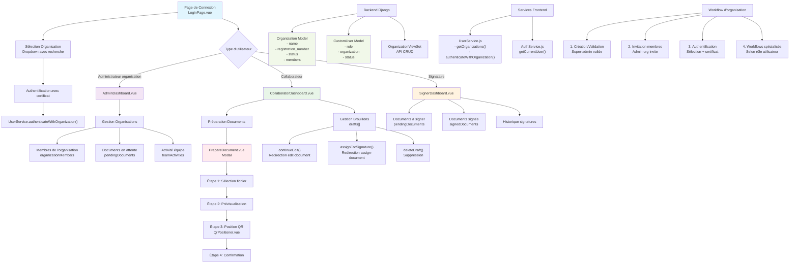
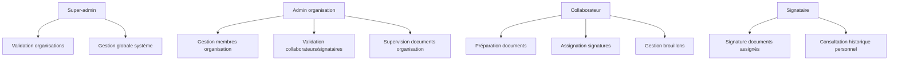

# 🏢 Workflow des Organisations - CertiSign

## 📋 Table des matières

- [🎯 Vue d'ensemble](#-vue-densemble)
- [🏗️ Architecture des organisations](#️-architecture-des-organisations)
- [🔐 Workflow d'authentification](#-workflow-dauthentification)
- [📊 Dashboards spécialisés](#-dashboards-spécialisés)
- [📄 Préparation de documents](#-préparation-de-documents)
- [🔄 Gestion des états](#-gestion-des-états)
- [🔒 Sécurité et isolation](#-sécurité-et-isolation)
- [📱 Interface utilisateur](#-interface-utilisateur)
- [🚀 Points d'amélioration](#-points-damélioration)

---

## 🎯 Vue d'ensemble

CertiSign implémente un système organisationnel complet permettant aux entreprises de gérer leurs processus de signature électronique de manière hiérarchique et sécurisée. Le système supporte multi-tenant avec isolation complète des données entre organisations.

### 🔗 Schéma du workflow complet



---

## 🏗️ Architecture des organisations

### 🗄️ Modèles Backend (Django)

#### **Organization Model**
```python
class Organization(models.Model):
    name = models.CharField(max_length=255)
    registration_number = models.CharField(max_length=100, unique=True)
    email = models.EmailField(blank=True, null=True)
    address = models.TextField(blank=True, null=True)
    status = models.CharField(max_length=20, choices=ORGANIZATION_STATUS, default='pending')
    created_at = models.DateTimeField(auto_now_add=True)
```

**Statuts disponibles :**
- `pending` : En attente de validation
- `active` : Organisation opérationnelle
- `rejected` : Organisation refusée

#### **CustomUser Model**
```python
class CustomUser(AbstractUser):
    role = models.CharField(max_length=20, choices=USER_ROLES, default='user')
    organization = models.ForeignKey(Organization, on_delete=models.SET_NULL, null=True)
    status = models.CharField(max_length=20, choices=USER_STATUS, default='pending')
    certificate_serial = models.CharField(max_length=255, unique=True)
    # ... autres champs certificat
```

**Hiérarchie des rôles :**
```
superadmin > admin > collaborator > signer > user
```

### 🌐 API et Services

#### **Backend - OrganizationViewSet**
- **CRUD complet** pour les organisations
- **Permissions granulaires** selon les rôles
- **Filtrage et recherche** avancés

#### **Frontend - UserService.js**
```javascript
// Méthodes principales
getOrganizations()                  // Liste des organisations actives
authenticateWithOrganization()     // Auth avec certificat + organisation
authenticateOrgAdmin()             // Auth admin d'organisation
```

---

## 🔐 Workflow d'authentification

### 🏠 Page de connexion (LoginPage.vue)

#### **Sélecteur d'organisation**
- **Dropdown personnalisé** avec recherche en temps réel
- **Filtrage intelligent** par nom d'organisation
- **Option "Aucune organisation"** pour utilisateurs individuels
- **Chargement dynamique** de la liste des organisations

```vue
<div class="organization-selector-container">
  <label class="organization-selector-label">Votre organisation</label>
  <div class="custom-select">
    <div class="select-selected" @click="toggleDropdown">
      <span v-if="selectedOrganization">{{ selectedOrganization.name }}</span>
      <span v-else>Aucune organisation</span>
    </div>
    <!-- Liste des organisations avec recherche -->
  </div>
</div>
```

#### **Types d'authentification**

| Type | Méthode | Utilisation |
|------|---------|-------------|
| **Admin organisation** | `authenticateOrgAdmin()` | Création/gestion organisation |
| **Membre organisation** | `authenticateWithOrganization()` | Sélection organisation existante |
| **Utilisateur simple** | `authenticateStandalone()` | Sans organisation |

---

## 📊 Dashboards spécialisés

### 👑 AdminDashboard.vue - Administrateur d'organisation

#### **Vue d'ensemble**
```vue
<div class="organization-info">
  <span class="org-name">{{ organizationName }}</span>
  <span class="status-badge" :class="organizationStatus">
    {{ organizationStatus }}
  </span>
</div>
```

#### **Fonctionnalités principales**

##### 📈 **Statistiques globales**
- Documents signés dans l'organisation
- Documents en attente de signature
- Nombre de membres actifs
- Activité quotidienne

##### 👥 **Gestion des membres**
```vue
<div v-for="member in organizationMembers" :key="member.id" class="member-item">
  <div class="member-details">
    <span class="member-name">{{ member.name }}</span>
    <span class="member-role">{{ getRoleDisplay(member.role) }}</span>
  </div>
  <div class="member-stats">
    <span>{{ member.documentsCount }} documents</span>
    <span>{{ member.lastActivity }}</span>
  </div>
</div>
```

##### 📊 **Sections dynamiques**
- **Documents en attente** : Supervision des signatures pendantes
- **Activité équipe** : Monitoring temps réel des actions
- **Documents signés** : Historique avec actions (télécharger, vérifier)
- **Gestion membres** : Administration des utilisateurs de l'organisation

### 🤝 CollaboratorDashboard.vue - Collaborateur

#### **Préparation de documents**
```vue
<button class="action-card primary" @click="openPrepareDocument">
  <div class="action-icon">
    <i class="bi bi-file-earmark-plus"></i>
  </div>
  <span class="action-title">Nouveau document</span>
</button>
```

#### **Gestion des brouillons**
```vue
<div v-for="doc in drafts" :key="doc.id" class="document-item">
  <div class="doc-actions">
    <button @click="continueEdit(doc)">Continuer l'édition</button>
    <button @click="assignForSignature(doc)">Assigner pour signature</button>
    <button @click="deleteDraft(doc)">Supprimer</button>
  </div>
</div>
```

#### **Filtrage organisationnel**
```vue
<div class="organization-filter-info">
  <i class="bi bi-filter-circle"></i>
  <span>Données filtrées pour l'organisation <strong>{{ organizationName }}</strong></span>
</div>
```

### ✍️ SignerDashboard.vue - Signataire

#### **Documents à signer**
```vue
<div v-for="doc in sortedPendingDocuments" :key="doc.id" 
     class="document-item" :class="{ 'urgent': doc.is_urgent }">
  <div class="doc-info">
    <span class="doc-name">{{ doc.document_name }}</span>
    <span v-if="doc.is_urgent" class="urgent-tag">URGENT</span>
  </div>
  <button @click="signDocument(doc)">Signer maintenant</button>
</div>
```

#### **Statistiques personnelles**
- Documents signés cette semaine
- Total des documents signés
- Temps moyen de signature

---

## 📄 Préparation de documents

### 🔧 PrepareDocument.vue - Workflow complet

#### **Étapes du processus**

| Étape | Description | Composants |
|-------|-------------|------------|
| **1. Sélection** | Upload PDF avec drag & drop | Input file, validation |
| **2. Prévisualisation** | Affichage iframe du PDF | PDF viewer, métadonnées |
| **3. Position QR** | Placement interactif du QR code | `QrPositioner.vue` |
| **4. Confirmation** | Statut et animations de soumission | Feedback utilisateur |

#### **Code d'intégration**
```vue
<div class="steps-progress">
  <div v-for="(step, index) in steps" :key="index"
       :class="['step', { 'active': currentStep >= index }]">
    <div class="step-number">{{ index + 1 }}</div>
    <div class="step-label">{{ step.label }}</div>
  </div>
</div>
```

#### **Intégration organisationnelle**
- Tous les documents incluent automatiquement `organization_id`
- Métadonnées enrichies avec informations organisationnelles
- Validation des permissions selon le rôle utilisateur

---

## 🔄 Gestion des états

### 📊 Matrice des statuts

#### **Organisation**
| Statut | Description | Actions disponibles |
|--------|-------------|-------------------|
| `pending` | En attente validation super-admin | Aucune |
| `active` | Opérationnelle | Toutes |
| `rejected` | Refusée | Aucune |

#### **Utilisateur**
| Statut | Description | Accès |
|--------|-------------|-------|
| `pending` | En attente approbation admin | Limité |
| `active` | Opérationnel | Complet |
| `rejected` | Refusé | Aucun |

### 🔐 Permissions hiérarchiques



---

## 🔒 Sécurité et isolation

### 🛡️ Isolation des données

#### **Filtrage automatique**
```javascript
// Toutes les requêtes incluent l'organisation
const organizationId = currentUser?.organization?.id;
const response = await axios.get(`/api/documents/`, {
  params: { organization_id: organizationId }
});
```

#### **Validation backend**
```python
# Vérification appartenance organisation
def get_queryset(self):
    if self.request.user.is_admin:
        return Document.objects.all()
    return Document.objects.filter(
        organization=self.request.user.organization
    )
```

### 🔐 Authentification multi-niveau

1. **Certificat numérique** : Authentification forte obligatoire
2. **Rôle organisationnel** : Permissions selon hiérarchie
3. **Validation temps réel** : Vérification statuts actifs

---

## 📱 Interface utilisateur

### 🎨 Indicateurs visuels

#### **Badges de rôle**
```vue
<span class="role-badge admin">Administrateur</span>
<span class="role-badge collaborator">Collaborateur</span>
<span class="role-badge signer">Signataire</span>
```

#### **Statuts organisation**
```css
.org-status-active { color: #28a745; }
.org-status-pending { color: #ffc107; }
.org-status-rejected { color: #dc3545; }
```

### 🧭 Navigation adaptative

#### **Redirections intelligentes**
```javascript
// Selon rôle et organisation
function continueEdit(doc) {
  const organizationName = user?.organization?.name;
  router.push({
    name: 'edit-document',
    params: { id: doc.id },
    query: { organization_name: organizationName }
  });
}
```

---

## 🚀 Points d'amélioration

### 📋 Fonctionnalités manquantes identifiées

#### **Pages à développer**
- [ ] **edit-document** : Page d'édition de documents (référencée mais manquante)
- [ ] **assign-document** : Page d'assignation de signatures
- [ ] **organization-settings** : Configuration avancée organisation

#### **Fonctionnalités à implémenter**
- [ ] **Système d'invitations** : Processus d'invitation nouveaux membres
- [ ] **Notifications temps réel** : WebSocket pour notifications push
- [ ] **Audit trail complet** : Traçabilité toutes actions organisationnelles
- [ ] **Templates d'organisation** : Templates spécifiques par organisation
- [ ] **Rapports avancés** : Analytics et reporting pour administrateurs
- [ ] **Gestion des rôles personnalisés** : Rôles configurables par organisation

#### **Améliorations techniques**
- [ ] **Cache côté client** : Optimisation performances listes organisations
- [ ] **Synchronisation hors ligne** : Mode offline pour signatures
- [ ] **API versioning** : Gestion versions API pour évolutivité
- [ ] **Tests automatisés** : Suite de tests pour workflows organisationnels

### 🔧 Optimisations suggérées

#### **Performance**
- Pagination intelligente pour grandes organisations
- Cache Redis pour métadonnées organisations
- Compression images et documents

#### **UX/UI**
- Mode sombre pour les dashboards
- Raccourcis clavier pour actions fréquentes
- Prévisualisation temps réel des modifications

---

## 📞 Support et documentation

### 📚 Ressources
- **Documentation API** : `/docs/api_endpoints.md`
- **Guide d'architecture** : `/docs/architecture.md`
- **Tests** : Répertoire `/test/`

### 🐛 Signalement de bugs
Pour signaler un bug ou proposer une amélioration concernant le workflow des organisations, veuillez créer une issue avec le label `organization-workflow`.

---

> **Note** : Ce document est maintenu à jour avec l'évolution du système. Dernière mise à jour : Janvier 2024 