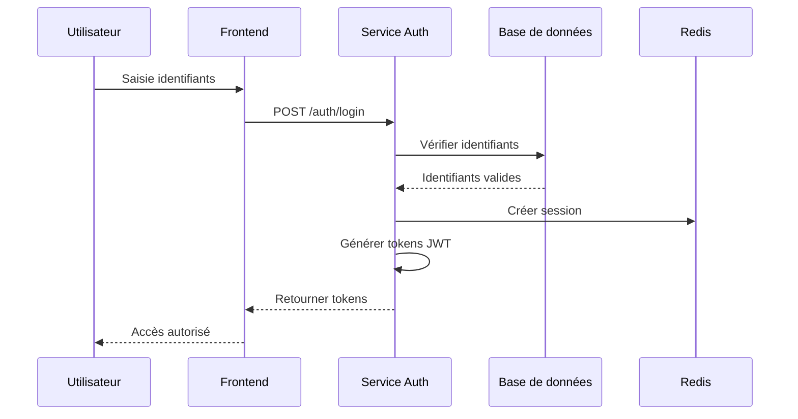
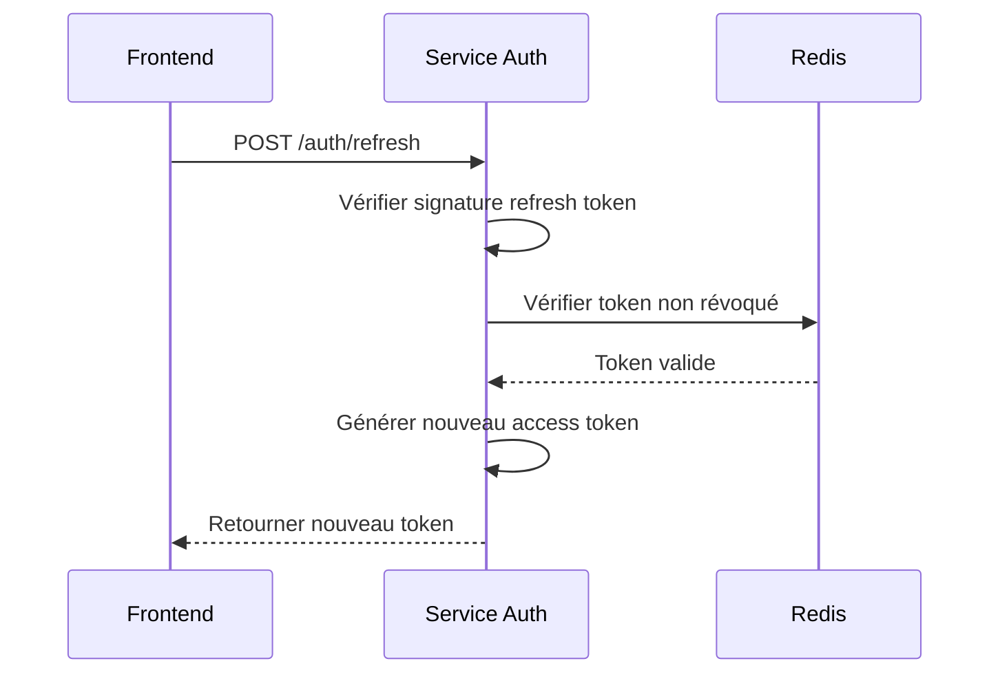

# Authentification

CertiSign implémente un système d'authentification robuste et sécurisé, basé sur des standards modernes pour garantir la sécurité des utilisateurs et de leurs données.

## Méthodes d'authentification

CertiSign prend en charge plusieurs méthodes d'authentification :

1. **Authentification par identifiant/mot de passe** - Méthode traditionnelle avec support pour la double authentification (2FA)
2. **Authentification par certificat** - Utilisation d'un certificat numérique personnel
3. **Authentification OAuth2** - Support pour les fournisseurs d'identité externes (Google, Microsoft, etc.)

## Flux d'authentification

### Authentification par identifiant/mot de passe

1. L'utilisateur saisit son identifiant (email ou nom d'utilisateur) et son mot de passe
2. Le système vérifie les informations d'identification
3. Si la 2FA est activée, le système demande un code de vérification supplémentaire
4. Après vérification réussie, le système génère et renvoie des tokens JWT

### Authentification par certificat

1. L'utilisateur sélectionne son certificat numérique
2. Le certificat est validé côté client et sa signature est envoyée au serveur
3. Le serveur vérifie la validité du certificat (non révoqué, non expiré, émis par une CA reconnue)
4. Après vérification réussie, le système génère et renvoie des tokens JWT

### Authentification OAuth2

1. L'utilisateur est redirigé vers la page de connexion du fournisseur d'identité
2. Après connexion réussie chez le fournisseur, le système reçoit un code d'autorisation
3. Le serveur échange ce code contre un token d'accès auprès du fournisseur
4. Les informations d'utilisateur sont récupérées via les API du fournisseur
5. Le système génère et renvoie des tokens JWT propres à CertiSign

## Architecture Token JWT

CertiSign utilise une architecture à deux tokens :

1. **Token d'accès** (Access Token) : Token à courte durée de vie (1 heure) utilisé pour authentifier les requêtes API
2. **Token de rafraîchissement** (Refresh Token) : Token à longue durée de vie (2 semaines) utilisé pour obtenir un nouveau token d'accès

### Structure du token JWT

```
header.payload.signature
```

#### Header

```json
{
  "alg": "RS256",
  "typ": "JWT"
}
```

#### Payload (Access Token)

```json
{
  "sub": "user_id",
  "name": "John Doe",
  "email": "john.doe@example.com",
  "role": "user",
  "iat": 1646513101,
  "exp": 1646516701,
  "iss": "certisign",
  "jti": "unique_token_id"
}
```

#### Payload (Refresh Token)

```json
{
  "sub": "user_id",
  "iat": 1646513101,
  "exp": 1647722701,
  "iss": "certisign",
  "jti": "unique_token_id",
  "token_type": "refresh"
}
```

## Gestion des sessions

Le système CertiSign maintient une liste de tokens valides/révoqués dans Redis pour une invalidation rapide si nécessaire.

### Déconnexion

Lors de la déconnexion :

1. Le token de rafraîchissement est ajouté à une liste de révocation
2. Le token d'accès est laissé expirer naturellement (courte durée de vie)
3. Les données de session sont supprimées du stockage Redis

### Rafraîchissement du token

Pour rafraîchir un token d'accès expiré :

1. Le client envoie le token de rafraîchissement au serveur
2. Le serveur vérifie la validité du token (signature, date d'expiration, non révoqué)
3. Si valide, un nouveau token d'accès est généré et renvoyé au client
4. Selon la politique, le token de rafraîchissement peut aussi être remplacé (rotation des tokens)

## Double authentification (2FA)

CertiSign prend en charge plusieurs méthodes de double authentification :

- **Authentificateurs TOTP** (Google Authenticator, Authy, etc.)
- **Email** (code à usage unique envoyé par email)
- **SMS** (code à usage unique envoyé par SMS)

### Configuration de la 2FA

1. L'utilisateur active la 2FA dans les paramètres de son compte
2. Selon la méthode choisie, il configure son authentificateur ou vérifie son numéro de téléphone/email
3. Une clé secrète TOTP est générée et stockée de manière sécurisée dans la base de données
4. Des codes de récupération sont générés et présentés à l'utilisateur (à conserver en lieu sûr)

### Processus d'authentification avec 2FA

1. L'utilisateur s'authentifie avec son identifiant/mot de passe
2. Le système détecte que la 2FA est activée et demande un code de vérification
3. L'utilisateur fournit le code généré par son authentificateur ou reçu par email/SMS
4. Le système vérifie la validité du code
5. Après vérification réussie, les tokens JWT sont générés et renvoyés

## Politiques de sécurité

### Gestion des mots de passe

- Longueur minimale : 10 caractères
- Complexité requise : lettres majuscules/minuscules, chiffres, caractères spéciaux
- Hachage : Argon2id avec sel aléatoire
- Politique d'expiration : 90 jours
- Historique des mots de passe : les 5 derniers mots de passe ne peuvent pas être réutilisés

### Verrouillage de compte

- 5 tentatives infructueuses entraînent un verrouillage temporaire (15 minutes)
- 10 tentatives infructueuses entraînent un verrouillage permanent (nécessitant une réinitialisation)
- Les tentatives d'authentification sont journalisées avec l'adresse IP et l'agent utilisateur

### Certificats

- Validation de la chaîne de confiance des certificats
- Vérification de la liste de révocation (CRL) et via OCSP
- Support pour les certificats qualifiés conformes au règlement eIDAS

## Intégration avec les systèmes existants

CertiSign peut s'intégrer avec les systèmes d'authentification d'entreprise existants :

- **LDAP/Active Directory** : Authentification contre un annuaire d'entreprise
- **SAML** : Prise en charge de l'authentification unique (SSO) via SAML 2.0
- **OpenID Connect** : Support du protocole OpenID Connect pour l'authentification fédérée

## Audit et journalisation

Toutes les activités d'authentification sont journalisées dans un système d'audit sécurisé :

- Connexions réussies/échouées
- Déconnexions
- Modifications des paramètres de sécurité
- Créations/révocations de tokens
- Réinitialisations de mot de passe
- Tentatives d'accès non autorisées

## Diagrammes de séquence

### Authentification standard



### Rafraîchissement de token



## Exemple d'implémentation

### Client (JavaScript)

```javascript
async function login(username, password) {
  try {
    const response = await fetch('/api/v1/auth/login', {
      method: 'POST',
      headers: {
        'Content-Type': 'application/json'
      },
      body: JSON.stringify({ username, password })
    });
    
    const data = await response.json();
    
    if (response.ok) {
      // Stocker les tokens
      localStorage.setItem('access_token', data.data.access_token);
      localStorage.setItem('refresh_token', data.data.refresh_token);
      return true;
    } else {
      throw new Error(data.error.message);
    }
  } catch (error) {
    console.error('Erreur de connexion:', error);
    return false;
  }
}

// Fonction pour rafraîchir le token
async function refreshToken() {
  const refreshToken = localStorage.getItem('refresh_token');
  
  if (!refreshToken) {
    return false;
  }
  
  try {
    const response = await fetch('/api/v1/auth/refresh', {
      method: 'POST',
      headers: {
        'Content-Type': 'application/json'
      },
      body: JSON.stringify({ refresh_token: refreshToken })
    });
    
    const data = await response.json();
    
    if (response.ok) {
      localStorage.setItem('access_token', data.data.access_token);
      return true;
    } else {
      // Si le refresh token est invalide, déconnecter l'utilisateur
      logout();
      return false;
    }
  } catch (error) {
    console.error('Erreur de rafraîchissement du token:', error);
    return false;
  }
}
```

### Serveur (Python/Django)

```python
from datetime import datetime, timedelta
import jwt
from django.conf import settings
from rest_framework.views import APIView
from rest_framework.response import Response
from rest_framework import status

class LoginView(APIView):
    def post(self, request):
        username = request.data.get('username')
        password = request.data.get('password')
        
        # Vérifier les identifiants
        user = authenticate(username=username, password=password)
        
        if not user:
            return Response({
                'status': 'error',
                'error': {
                    'code': 'AUTHENTICATION_ERROR',
                    'message': 'Identifiants invalides'
                }
            }, status=status.HTTP_401_UNAUTHORIZED)
        
        # Générer les tokens
        access_token = generate_access_token(user)
        refresh_token = generate_refresh_token(user)
        
        # Stocker le refresh token dans Redis
        redis_client.setex(
            f"refresh_token:{user.id}:{refresh_token['jti']}", 
            settings.REFRESH_TOKEN_EXPIRY,
            "valid"
        )
        
        return Response({
            'status': 'success',
            'data': {
                'access_token': access_token,
                'refresh_token': refresh_token,
                'token_type': 'bearer',
                'expires_in': settings.ACCESS_TOKEN_EXPIRY
            }
        })

def generate_access_token(user):
    payload = {
        'sub': str(user.id),
        'name': user.get_full_name(),
        'email': user.email,
        'role': user.role,
        'iat': datetime.utcnow(),
        'exp': datetime.utcnow() + timedelta(seconds=settings.ACCESS_TOKEN_EXPIRY),
        'iss': 'certisign',
        'jti': str(uuid.uuid4())
    }
    
    return jwt.encode(payload, settings.JWT_PRIVATE_KEY, algorithm='RS256')
``` 